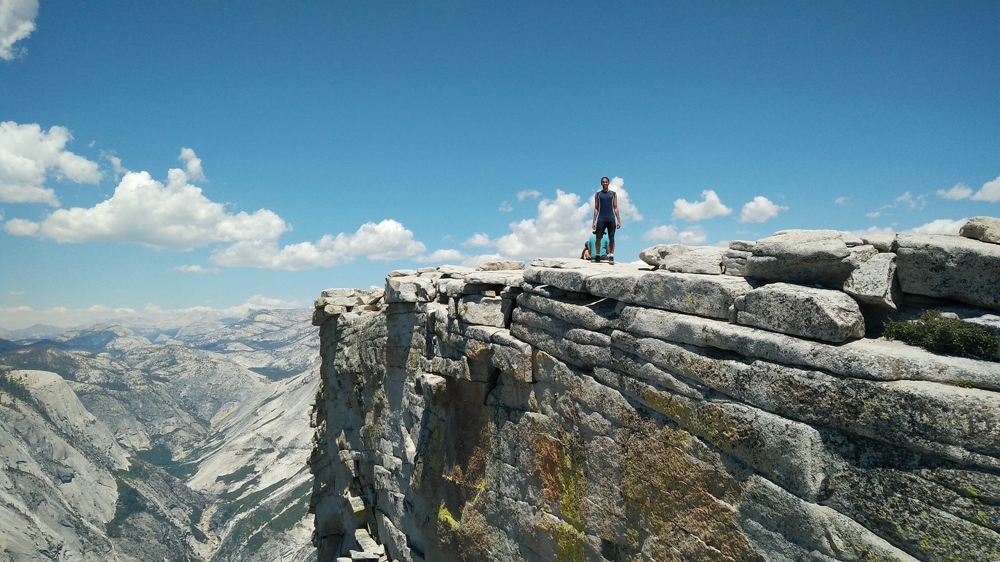

# FEWD-a01
FEWD assignment 1

# About Me

## Hobbies

### Sports
I enjoy playing group sports. I like the teamwork, strategy, and problem solving aspects of team sports. An aspect of sports that I think makes them really enjoyable is when teammates work well together, both on offense and defense. This usually means that one teammate needs help and another teammate will do what they can, sometimes without any communication. My favorite sports to play are:
* Basketball
* Ultimate Frisbee
* Gaelic Football
* Volleyball

I also enjoy hiking. My favorite place to hike is Yosemite National Park. My favorite hike that I have done is Half Dome in Yosemite Naitonal Park. Here is a pictures of me at the top of Half Dome:

## Podcasts
I also enjoy listening to podcasts. In my opinion, there are a lot of high quality podcasts, in terms of the quality of their content. Podcasts cover a great variety of topics, and there is usually something for almost everyone. My favorite types of podcasts are news and story related. I enjoy:
* Radiolab
* NPR Politics Podcast
* On Point
* 1A
* Marketplace

You can check some these out at the [NPR podcasts website.](https://www.npr.org/podcasts/)
